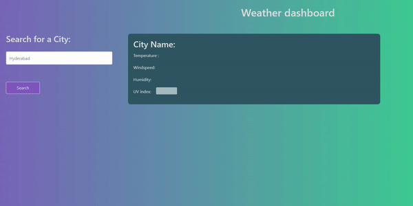

# Weather-report

## About The Project

This project is to get the current weather of a particular city. The first website is displayed with no date. when the user search the city, they get current weather and the following 5days weather as well, and the search is saved below the search button .

## Technologies used

- html
- css
- java script

## Apis
api.openweathermap.org/data/2.5/weather?q={city name}&appid=65d399c284fc843c554beb939eac0cb5
https://api.openweathermap.org/data/2.5/onecall?{longitude}&{latitude}&exclude=hourly,daily&appid=5f6d35978b34af25b79ac449ccc5ee8c

## functionality 
- user need to click on the search button to get the current weather and fallowing 5 days 
## Development process
- HTML and CSS pages are created
- added styling
- added comments to HTML and CSS
- collected APIs and tested it
- written java script code 
- final test on (22/10/2021)

## The following appearance of the site:

# URL of the website

 https://rammohanmiryala.github.io/Wether-report/
